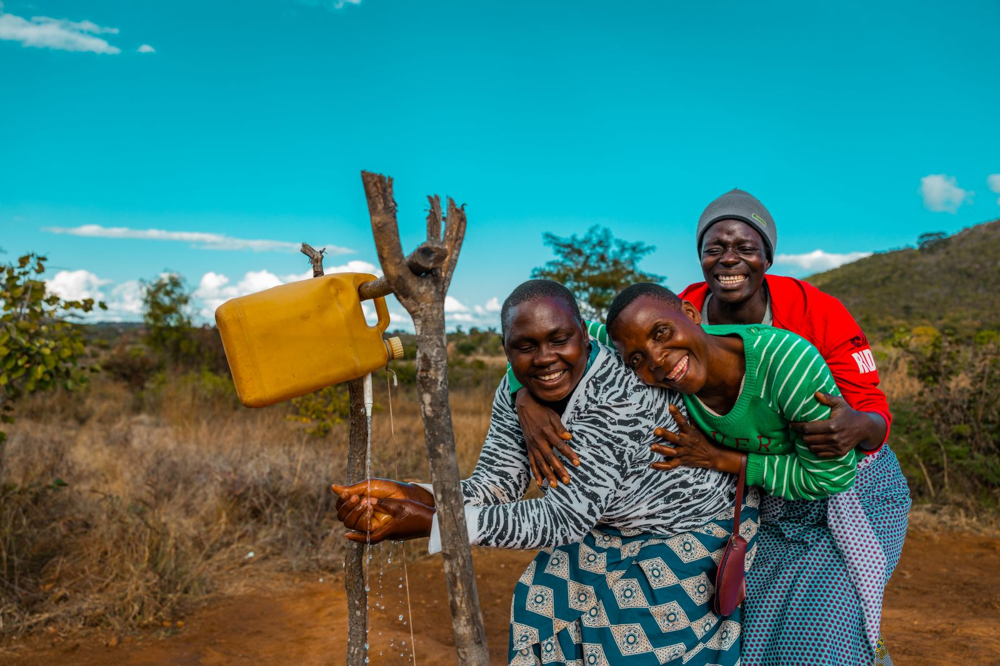

<!DOCTYPE html>
<html lang="en">
<head>
  <meta charset="UTF-8" />
  <meta name="viewport" content="width=device-width, initial-scale=1.0"/>
  <title>Charity: Water Landing Page</title>

  <!-- Adobe Fonts (replace with real link) -->
  <link rel="stylesheet" href="https://use.typekit.net/your-kit-id.css">

  
</head>
<body>

  <!-- Header -->
  <header>
    

      
    

    

      You Spark the <strong>Change</strong>. 
      <strong>We</strong> Deliver the Water.
    

  </header>

  <!-- Main Content -->
  <section class="main">
    

      

        See how student activists are creating 
        <strong>real change</strong> — and how your support fuels their mission 
        and delivers clean water where it matters most.
      

      <a href="#" class="cta-button">JOIN US</a>
    

    

      
    

  </section>

</body>
</html>

